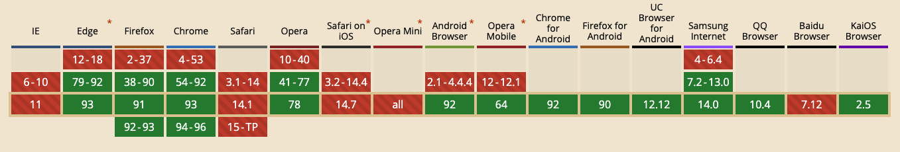

## BroadCastChannel
BroadCastChannel API 可以实现 **同源** 下，提供了公用的通讯通道。用于浏览器不同窗口、不同 Tab 页面、或者标签页与 iframe 的通讯。

原理：通过创建一个监听某个频道下的 BroadCastChannel 对象，来接受和发送该频道下的所有消息。


### 相关 API
通过创建 BroadCastChannel 对象，即可加入指定的频道，参数是频道名称。不同频道名称对应不同频道，相互没关系。

``` js
// bc bc1 无关
const bc = new BroadCastChannel('test channel')
const bc1 = new BroadCastChannel('test channel1')
```

可通过 BroadCastChannel 对象的 `postMessage` 方法来发送消息，其中参数可以是任意对象：

``` js
bc.postMessage('This is a msg of test channnel.')
```

可通过监听频道对象的 `message` 事件，来获取频道内的所有消息：

``` js
bc.onmessage = function(e) {
  console.log(e.data)
}
```

使用 `close` 方法，可以离开频道。这将断开该对象和其关联频道间的联系，并允许它被垃圾回收：

``` js
bc.close()
```

### 案例
index.html 通过 iframe 加载 a.html，在新窗口下打开 b.html。它们的 script 分别是：

``` html
<!-- index.html -->
<script>
  function onLoad() {
    const bc = new BroadcastChannel('test channel')
    bc.postMessage('index')
    bc.onmessage = function (e) {
      console.log(e.data)
    }
  }
</script>

<!-- a.html -->
<script>
  const bc = new BroadcastChannel('test channel')
  bc.postMessage('a')
  // setTimeout(() => bc.postMessage('a'), 1000)
  bc.onmessage = function (e) {
    console.log(e.data)
  }
</script>


<!-- b.html -->
<script>
  const bc = new BroadcastChannel('test channel')
  bc.onmessage = function (e) {
    console.log(e.data)
  }
</script>
</body>
```
当刷新 index.html 时，b.html 始终打印 `index`、`a`：
- 若 a.html 内没使用 setTimeout，则 index.html 控制台打印 `index`（？求指教）。
- 若 a.html 内使用了 setTimeout，则 index.html 控制台打印 `index` 和 `a`。

### 兼容性


兼容IE或者旧版本的 chrome/firefox，则考虑使用 `broadcast-channel-polyfill` 或者基于 `localStorage` 和 `storage` 事件来实现跨标签页通讯。

### bc.postMessage VS window.postMessage
方法|跨源|说明
--|--|--
bc.postMessage|否|
window.postMessage|可|需要维护对 iframe 或者 window.open 的引用才能与之通信。

### refs
- [MDN BroadCastChannel](https://developer.mozilla.org/zh-CN/docs/Web/API/Broadcast_Channel_API)
- [JavaScript 如何实现同源通信?](https://mp.weixin.qq.com/s/hw_IUf7cs7YpCKvphz18Zg)
- [broadcast-channel-polyfill](https://github.com/alexis89x/broadcast-channel#broadcast-channel-polyfill)
