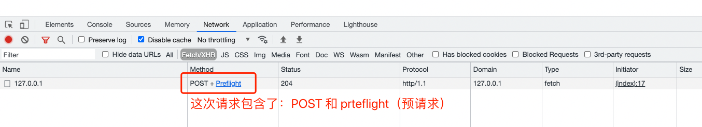
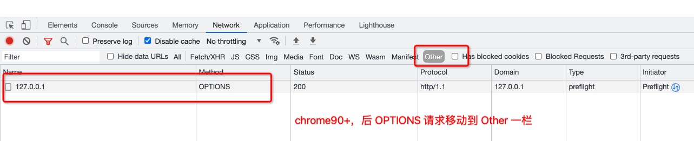

## CORS
`Cross Origin Resource Sharing` 跨域资源共享，允许跨源资源共享得以安全进行。浏览器一旦发觉当前请求属于 ajx 跨源请求，就会自动添加一些响应头信息，有时还会会附加的请求，但用户无感。

什么情况下需要 CORS：
- xhr/fetch 发起的跨站点 http 请求；
- 使用 `drawImage` 将 images/video 绘制的 canvas；
- CSS 中通过 `@font-face` 使用跨源字体资源；

### CORS 涉及到的 response headers
- `Access-Control-Allow-Origin`: 允许哪些站点的请求。无论是否是 **简单请求**，都要设置之。
- `Access-Control-Allow-Headers`: 允许请求头设置一些自定义请求头，或者某些请求头的值不符合 CORS 要求的枚举值。
- `Access-Control-Allow-Methods`: 允许除开（GET、POST、HEAD）请求方法。
- `Access-Control-Allow-Expose-Headers`: 允许客户端获取到自定义响应头。
- `Access-Control-Allow-Credentials`: 允许客户端发送请求时，携带 cookie。
- `Access-Control-Max-Age`: 用来设置 CORS 的有效时间，单位是 **秒**。在这段有效时间内，浏览器无须为同一请求再次发起预检请求。

### 简单请求与复杂请求
- 请求方法仅限于：`GET`、`POST`、`HEAD`
- 没有人为设置以下集合之外的其他请求头字段：`Accept`、`Accept-Language`、`Content-Language`、`Content-Type`。其中 `Content-Type` 的值仅限：
  - `text/plain`
  - `multipart/form-data`
  - `application/x-www-form-urlencoded`
- 请求中的任意XMLHttpRequestUpload 对象均没有注册任何事件监听器。XMLHttpRequestUpload 对象可以使用 XMLHttpRequest.upload 属性访问。
- 请求中没有使用 ReadableStream 对象

任何不符合上述要求的请求，将会被认为 **复杂请求**。对于复杂请求：
- 浏览器会有一次 **预请求**。
- 服务端可能要返回多个 `Access-Control-Allow-` 字段。

对于简单的 CORS 请求，直接在响应头内设置 `Access-Control-Allow-Origin` 字段即可：

``` js
fetch('http://127.0.0.1:7001')
  .then(res => res.json())
  .then(console.log)

async index() {
  const { ctx } = this
  ctx.set('Access-Control-Allow-Origin', '*')
  ctx.body = {
    msg: 'hi egg!'
  }
}
```

### 预请求
CORS 每次进行 **复杂请求** 之前，默认都会先发出预请求，目的是让浏览器向服务器确认一些信息：
- 当前网页所处的源（protocol + domain + port）是否在服务器的白名单内。
- 可以使用哪些 HTTP 方法和请求头。
- 是否可携带 cookie。

不满足服务器 CORS 设置，将报错。一个简单的预请求，修改 `Content-Type` 的值是 `application/json`：

``` js 
fetch(
  'http://127.0.0.1:7001', 
  {
    method: 'POST',
    headers: { 
      'Accept': 'application/json',
      'Content-Type': 'application/json'
    },
    body: JSON.stringify({
      name: 'name'
    })
  }
)
.then(res => res.json())
.then(console.log)

async indexOpt() {       //  这是 options 预请求 
  const { ctx } = this;
  ctx.set('Access-Control-Allow-Origin', '*')
  ctx.set('Access-Control-Allow-Headers', 'Content-Type')
  ctx.status = 200
  ctx.body = 'ok'
}
async index() {          // 这是真正的 post 请求
  const { ctx } = this
  ctx.set('Access-Control-Allow-Origin', '*')
  ctx.body = ctx.request.body
}
```

可以在浏览器控制台中看到 `OPTIONS` 请求：




> chrome 90 之前展示预请求的方法：在 chrome 地址栏总输入 chrome://flags/#out-of-blink-cors，将其设置为 Disabled 后重启浏览器

### 设置自定义请求头
客户端想要向服务器发送某些自定义请求头，或不符合 CORS 枚举值的请求普通头，都需要在 **预请求** 中标识这些请求头（以 , 隔开）。比如：客户端要向服务器发送 Token 用户标识和 `Content-Type` 的值是 `application/json`：

``` js
fetch(
  'http://127.0.0.1:7001', 
  {
    method: 'POST',
    headers: { 
      'Accept': 'application/json',           // Accept 不传，默认是 */*，接收任意响应格式   
      'Content-Type': 'application/json',
      Token: 'token'
    },
    body: JSON.stringify({
      name: 'name'
    })
  }
)
.then(res => res.json())
.then(console.log)

async index() {
  const { ctx } = this
  ctx.set('Access-Control-Allow-Origin', '*')
  ctx.body = ctx.request.body
}
async indexOpt() {                            // 在预请求中设 Access-Control-Allow-Headers         
  const { ctx } = this;
  ctx.set('Access-Control-Allow-Origin', '*')
  ctx.set('Access-Control-Allow-Headers', 'Content-Type, Token')
  ctx.status = 200
  ctx.body = 'ok'
}
```

### 获取自定义响应头
在 CORS 跨源请求中，绝大多数的响应头客户端都获取不到，必须在 **真实请求** 中设置响应头 `Access-Control-Expose-Headers` 字段。

``` js
fetch(
  ...
)
.then(res => {
  // '0.0.1' 'Tue, 07 Sep 2021 00:30:13 GMT' 'application/json; charset=utf-8' '*'
  console.log(
    res.headers.get('X-Version'), 
    res.headers.get('Date'),
    res.headers.get('content-type'),
    res.headers.get('Access-Control-Allow-Origin'),
  )
  return res.json()
})
.then(console.log)

// 真实请求
async index() {
  ctx.set('Access-Control-Expose-Headers', 'Date, X-Version, Access-Control-Allow-Origin')
  ctx.set('X-Version', '0.0.1')
  ...
}
```

### 发起请求时，携带 cookie
比如，在 127.0.0.1:5000 上的站点，访问 127.0.0.1:7001 的服务器，需要带上相关 cookie：
- 前端 fetch 请求，设置参数 `credentials: include`。
- 在 **预请求**、**真正请求** 中：
  - 设置的 `Access-Control-Allow-Origin` 不能是 `*`。
  - 设置响应头 `Access-Control-Allow-Credentials` 为 `true`。

``` js
fetch(
  'http://127.0.0.1:7001', 
  {
    credentials: 'include',
    ...
  }
)

async index() {
  const { ctx } = this
  ctx.set('Access-Control-Allow-Origin', 'http://127.0.0.1:5000')
  ctx.set('Access-Control-Allow-Credentials', true)
  ...
}
async indexOpt() {
  const { ctx } = this;
  ctx.set('Access-Control-Allow-Origin', 'http://127.0.0.1:5000')
  ctx.set('Access-Control-Allow-Credentials', true)
  ...
}
```

> 注意：尽管这种方式使得 cookie 可以跨源传输，但仍然不会违背 cookie 不可跨域的原则（domain 属性）。
> 比如：不可能使 `localhost:5000` 的 cookie 通过 CORS 传输到 `127.0.0.1:7001` 的服务器上

### 设置请求缓存
不必为每次 CORS 请求都进行预请求，可以通过 **预请求** 的响应头 `Access-Control-Max-Age` 来设置请求缓存：

``` js
async indexOpt() {
  const { ctx } = this
  ctx.set('Access-Control-Max-Age', 86400)    // 86400s 也就是 24h
  ...
}
```

**注意**：
- `Access-Control-Max-Age` 并不是为一下所有的请求都设置缓存，而是经过其处理的请求，才有 CORS 缓存。
- 若浏览器的控制台勾选了 `Disable cache`，则本地不缓存，每次请求都发预请求。

### CORS 优缺点
优点：
- 能完成跨源 ajax 地请求。
- 请求来源可控，能直接追溯（Origin 字段）。
- 前端代码量极少，几乎都在后台配置。
- 不需要中间服务器。

缺点：
- 要处理 `OPTIONS` 请求。
- 要写不少响应头信息。

### refs
- [MDN 跨源资源共享（CORS）](https://developer.mozilla.org/zh-CN/docs/Web/HTTP/CORS)
- [CORS 完全手册之 CORS 详解](https://mp.weixin.qq.com/s/Cqay4VvYDjADbT_b97xW2w)
- [浅析跨域资源共享（CORS）及其安全性](https://www.nsfocus.com.cn/upload/contents/2015/03/o_19fenkhba1u155b617pcun216q4b.pdf)
- [nodejs.ForbiddenError: invalid csrf token,egg中post失败解决方案](https://blog.csdn.net/wron_path/article/details/112425731)
- [Egg.js (五) 发送POST请求和获取参数](https://blog.csdn.net/zhuming3834/article/details/107553855)
- [MDN fetch](https://developer.mozilla.org/zh-CN/docs/Web/API/Fetch_API/Using_Fetch)
- [Chrome不显示OPTIONS请求的解决方法2021版chrome90](https://blog.csdn.net/letterTiger/article/details/119024009)

