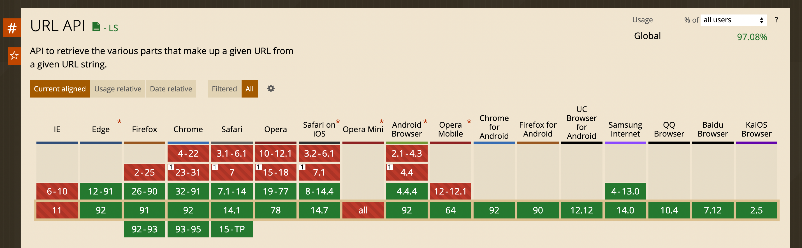

## URL
[URL](https://developer.mozilla.org/zh-CN/docs/Web/API/URL/URL) 是挂载在 window 下的原生构造方法（或者说是一个类），用其生成的实例具有处理 url 的能力。
- 可以很方便地获取 protocol、origin、pathname、query、hash 参数。
- 不兼容 IE，其他兼容。
- 可在 web worker 中使用。

### 创建 url 实例
``` js
const url = new URL(url[, base])
```
url 相对地址或者绝对地址。
- 如果是相对地址，需要设置base参数；
- 如果是绝对地址，则会忽略base设置；

base 如果URL地址是相对地址，则需要这个参数，作用是作为相对计算的基础地址，默认是 ''。

```
const base = 'http://example.com/c/d'
```
举例 | 结果 | 说明
-- | -- | --
new URL('./a/b', base).href | http://example.com/c/a/b | d 会被取代
new URL('./a/b', base + '/').href | http://example.com/c/d/a/b | 追加
new URL('../a/b', base).href | http://example.com/a/b | c/d 会被取代
new URL('../a/b', base + '/') | http://example.com/c/a/b | d 会被取代
new URL('/a/b', base).href | http://example.com/a/b | /c/d 会被忽略

### MDN 案例：
``` js
let m = 'https://developer.mozilla.org';
let a = new URL("/", m);  // => 'https://developer.mozilla.org/'
let b = new URL(m);       // => 'https://developer.mozilla.org/'
        new URL('en-US/docs', b);  
        // => 'https://developer.mozilla.org/en-US/docs'

let d = new URL('/en-US/docs', b); 
        // => 'https://developer.mozilla.org/en-US/docs'

        new URL('/en-US/docs', d); 
        // => 'https://developer.mozilla.org/en-US/docs'

        new URL('/en-US/docs', a); 
        // => 'https://developer.mozilla.org/en-US/docs'
        
        new URL(
          '/en-US/docs', 
          "https://developer.mozilla.org/fr-FR/toto"
        );
        // => 'https://developer.mozilla.org/en-US/docs'

        new URL('/en-US/docs', '');                    
        // Raises a TypeError exception as '' is not a valid URL

        new URL('/en-US/docs');                        
        // Raises a TypeError exception as '/en-US/docs' is not a valid URL

        new URL('http://www.example.com', );           
        // => 'http://www.example.com/'

        new URL('http://www.example.com', b);          
        // => 'http://www.example.com/'

        new URL("//foo.com", "https://example.com")    
        // => 'https://foo.com' (see relative URLs)
```

### URL实例对象的属性

```
const url =  new URL("//foo.com/get?a=1#cyx", "https://example.com")
``` 
属性名 | 含义 | 值
-- | -- | -- 
protocol | 协议 | https://
port | 端口 | ''，**这儿不是 80！**
origin | foo.com | 域名
pathname | /get | 请求路径
search | ?a=1 | 请求参数，**注意有 ?**
searchParams | [searchParams](./URLSearchParams.md) 对象 | 用来操作 query 参数的
hash | #cyx | hash 值，**注意有 #**

### URL的静态方法
方法名 | 解释
-- | --
URL.createObjectURL(object) | 可以把 File，Blob 或者 MediaSource 对象变成一个一个唯一的 blob URL。
URL.revokeObjectURL(objectURL) | 销毁由 URL.createObjectURL() 创建的 URL 对象，释放内存！
使用以上方法：可以预览图片、[下载文件](file-download/a.md)等。

#### 兼容性
IE 不支持，其他兼容良好。这有 polyfill（兼容到IE 10+，不支持 URL 的静态方法） [url-polyfill](https://github.com/lifaon74/url-polyfill)


