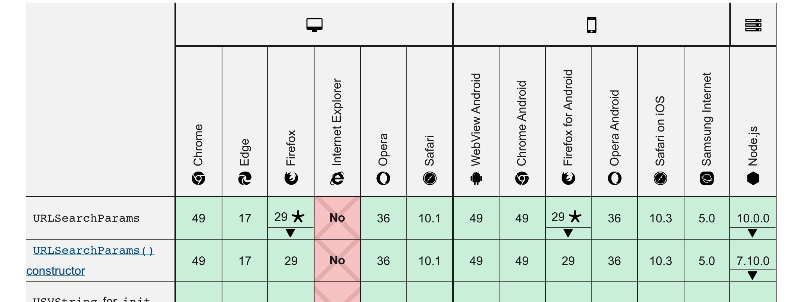

## URLSearchParams
[URLSearchParams](https://developer.mozilla.org/zh-CN/docs/Web/API/URLSearchParams) 是挂载在 window 下的原生构造方法（或者说是一个类）。用其生成的实例具有处理 url 查询字符串的能力。

### 日常作用
- pasre： 解析一个字符串，找到其中的 key、value；
- stringify：序列化数组或者对象字面量；

### 用 URLSearchParams 创建对象

创建对象时传入 url 即可
``` js
// 字符串形式
const search = new URLSearchParams(location.search)
const query = new URLSearchParams('?a=1&b=2')

// 二维数组形式
const paramsByArr = new URLSearchParams([['a', 1], ['b', 2]])

// 键值对儿形式
const paramsByObj = new URLSearchParams({
  a: 1,
  b: 2
})
```

### URLSearchParams 实例方法

**URLSearchParams.append(name, key)** 添加新的查询参数：
``` js
const query = new URLSearchParams('?a=1&b=2')
query.append('c', 3)
query.toString() // a=1&b=2&c=3
```

**URLSearchParams.delete(name)** 根据键名删除对应的查询字符串：
``` js
const query = new URLSearchParams('?a=1&b=2')
query.delete('b')
query.toString() // a=1
```

**URLSearchParams.keys()** 返回查询参数的迭代对象；<br />
**URLSearchParams.values()** 返回查询参数值的迭代对象；<br />
**URLSearchParams.entries()** 返回查询参数对的迭代对象；<br />
可迭代对象均可使用 for of 遍历：
``` js
const query = new URLSearchParams('?a=1&b=2')
for (let [k, v] of query) {
  ...
}
```

**URLSearchParams.get(name)** 获取某个查询参数值：
``` js
const query = new URLSearchParams('?a=1&b=2')
query.get('a') // '1'
```

**URLSearchParams.getAll(name)** 获取某个查询参数值列表
``` js
const query = new URLSearchParams('?a=1&b=2&b=3')
query.getAll('b') // ['2', '3']
```

**URLSearchParams.get(name)** 判断是否存在某个查询参数
``` js
const query = new URLSearchParams('?a=1&b=2')
query.has('a') // true
```

### 兼容性
IE 不兼容，chrome 49+ 开始兼容。这有个 polyfill [url-search-params-polyfill](https://github.com/jerrybendy/url-search-params-polyfill/)



### refs
- [张鑫旭 JS URL()和URLSearchParams() API接口详细介绍](https://www.zhangxinxu.com/wordpress/2019/08/js-url-urlsearchparams/)
- [让URLSearchParams帮你生成和解析参数字符串](https://zhuanlan.zhihu.com/p/29581070?utm_source=com.daimajia.gold&utm_medium=social)
- [new URLSearchParams()获取不到第一个参数了？](https://juejin.cn/post/6844904161184595982)
- [qs](https://github.com/ljharb/qs)
- [querystring](https://github.com/Gozala/querystring)
- [querystring-util](https://github.com/sm-bugu/querystring-util)
