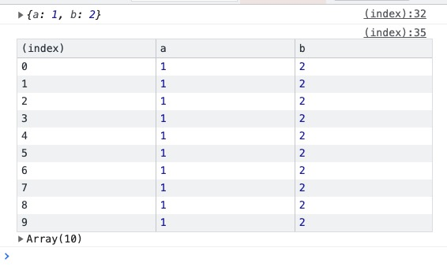
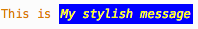
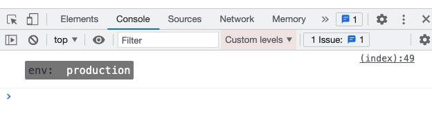

## console
browser 环境下，挂载在 window 对象下的全局对象（在 Web Worker 中也能使用）。用来在控制台调试。

### console.time/console.timeEnd
一对方法。用来统计一段 js 代码的执行时间。
> 注意：这两个函数参数必须一致。参数类型可以是任意 object

``` js
const arg = Function

console.time(arg)
for (let i = 0; i < 100000000; ++i);
console.timeEnd(arg)  

// function Function() { [native code] }: 64.3349609375 ms
```

手写 console.time/console.timeEnd：
``` js
;(function (console) {
  if (!console || console.myTime) return

  var timer = {}
  console.myTime = function(str) {
    timer[str] = Date.now()
  }

  console.myTimeEnd = function(str) {
    console.log(str + ': ' + (Date.now() - timer[str]) + 'ms')
    delete timer[str]
  }
})(window.console)
```

### console.log/console.table
对于简单的数据结构，log 方法足以。对于 json 数组，使用 console.table 更加合适。

``` js
const obj = {
  a: 1,
  b: 2
}
console.log(obj)

const arr = Array.from({ length: 10 }, () => obj)
console.table(arr)
```



### 打印有样式的 log
为了一条 log 的部分内容更加醒目，可以为 log 部分内容定义样式。例如：

``` js
console.log(
  "This is %cMy stylish message", 
  "color: yellow; font-style: italic; background-color: blue;padding: 2px"
)
```



如果将要打印的 log 含有多个 %c，可对应多个样式串：

``` js
console.log(
  '%cenv: %cproduction',
  'margin: 10px 0 10px 10px; padding: 4px; background: grey; font-size: 14px; border-radius: 2px 0 0 2px;',
  'margin: 10px 0 10px 0px; padding: 4px; background: grey; font-size: 14px; border-radius: 0 2px 2px 0; color: #fff'
)
```



`%c` 语法可用的属性如下：
display、margin、padding、background、color、font 相关属性、line-height、word-spacing 等。

支持 `%c` 语法的的不止 console.log，以下方法也支持：
`console.info`、`console.warn`、`console.error`、`console.debug`

第三方库：支持在浏览器环境下彩色打印 log: 
- [Console Colors](https://github.com/yairEO/console-colors)
- [logt](https://github.com/sidhantpanda/logt)

### refs
- [MDN console](https://developer.mozilla.org/zh-CN/docs/Web/API/Console)
- [chrome 开发者文档：Console API reference](https://developer.chrome.com/docs/devtools/console/api/#log)
- [多彩的 console.log](https://juejin.cn/post/6844903725908099079)
- [console.time polyfill](https://github.com/callmehiphop/console-time/blob/master/console-time.js)
