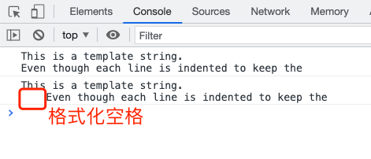

## 模板字符串
作用：
- 可当作普通字符串使用
- 定义多行字符串更方便 <code>``</code>
- 在字符串中嵌入变量更方便 <code>${}</code>

``` js
let str = '模板字符串', str1 = `模板字符串`
console.log(str === str1)      // true

const hi = '\
  hello\
    world!\
'
const hi1 = `
  hello
    world!
`

const prev = 'hello', suffix = 'world'
const h3 = '\
  '+ prev +'\
    '+ suffix +'!\
'
const hi4 = `
  ${prev}
    ${suffix}!
`
```

### 嵌入的变量 toString
在字符串拼接或者嵌入变量中，相当于执行了变量的 `toString` 方法：

``` js
const obj = {}, n = 1, str = 'str'
console.log(                   // [object Object] 1 str
  `${obj} ${n} ` + str
)
```

### 模版字符串之间可以相互嵌套
比如下面一段 jsx：

``` jsx
const todos = addrs => `
  <table>
    ${addrs.map(addr => `
      <tr><td>${addr.first}</td></tr>
      <tr><td>${addr.last}</td></tr>
    `).join('')}
  </table>
`
```

### 模版字符串内使用反引号
需要对反引号进行转义，否则报语法错误 `Uncaught SyntaxError: Unexpected identifier`：

``` js
const str = `
  \`hello
      world\`
`
```

### 模版字符串的不足
在定义多行字符串时，模版字符串会存在 “格式化空格”。因为为了保证代码整齐通常会换行后缩进，但该缩进会被模板字符串认为是字符串的一部分：

``` js
const str = `This is a template string.\n`
  + `Even though each line is indented to keep the`

console.log(str)

const str1 = `This is a template string.
  Even though each line is indented to keep the`

console.log(str1)
```



为了解决给问题，所以我们不得不把这段 “格式化空格” 当作一个变量：

``` js
const formatSpace = '\n'
const str2 = `This is a template string.${
  formatSpace}Even though each line is indented to keep the`

console.log(str2 === str)       // true
```

### refs
- [模板字符串](https://es6.ruanyifeng.com/#docs/string#%E6%A8%A1%E6%9D%BF%E5%AD%97%E7%AC%A6%E4%B8%B2)
- [面试篇】2020面试官问ES6你知道怎么回答吗？不知道的话值得一点](https://juejin.cn/post/6881513523826917390#heading-6)
- [JavaScript的模板字符串，如何保持多行缩进且去除格式化空格？](https://juejin.cn/post/6844903742731616270)
