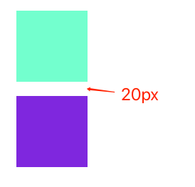

## BFC
`Block Formatting Context` 块格式化上下文。它是盒模型布局中渲染模式的一种，指的是一个独立的渲染区域、一个隔离的独立容器。

> 独立/隔离：外部元素不会影响内部元素的布局排列，反之也是一样。

### BFC 特定的布局规则
- 计算高度时，浮动元素的高度也会参与计算（用来清除浮动）。
- BFC 区域内容不会与浮动元素重叠（防止文字环绕，实现两栏/三栏布局）。
- BFC 是一个独立的容器，内外元素之间无影响（解决 margin 重叠问题）。

### 如何创建一个 BFC
- `overflow` 值不是 `visible` 的元素。
- display 的一些值：`inline-block`、`flex`、`inline-flex`、`table`、`table-cell` 等。
- 浮动元素。`float` 不是 `none`。
- 绝对定位 `absolute`或者固定定位 `fixed` 元素。 

### 解决 margin 合并问题
原理：只有在同一个 BFC 区域内，相邻或者嵌套的元素才可能发生外边距合并。

``` html
<section class="container">
  <div class="left"></div>
</section>
<div class="right"></div>
```

``` css
.left, .right {
  margin: 10px;
  width: 100px;
  height: 100px;
}

.left {
  background-color: aquamarine;
}

.right {
  background-color: blueviolet;
}
```


当父元素 `div.container` 设置成 BFC 时，`div.left` 和 `div.right` 就是属于不同 BFC 下的元素，则不会发生外边距合并问题。

``` css
.container {
  overflow: auto;
}
```



### 清除浮动
可借用 BFC 清除因为子元素浮动而对父元素的坍塌问题：[BFC 清除浮动](float.md)。

### 两栏布局
``` html
<section class="container">
  <div class="left"></div>
  <div class="right">
    <div class="right-inner">
      right-inner
    </div>
  </div>
</section>
```

``` css
.left {
  float: left;
  width: 100px;
  background-color: aquamarine;
}

.right {
  padding: 10px;
  background-color: blueviolet;
}

.right-inner {
  height: 300px;
  background-color: aqua;
}
```


发现 `div.left` 浮动后，`div.right` 因为文档流原因被挡在下面。按照 “BFC 区域内容不会与浮动元素重叠” 原则，如果将 `div.right` 设置成 BFC，那么其将不会被覆盖：

``` css
.right-inner {
  overflow: auto;
  ...
}
```

效果如下：


### refs
- [学习 BFC (Block Formatting Context)](https://juejin.cn/post/6844903495108132877#heading-14)
- [史上最全面、最透彻的BFC原理剖析](https://github.com/zuopf769/notebook/blob/master/fe/BFC%E5%8E%9F%E7%90%86%E5%89%96%E6%9E%90/README.md)
- [MDN BFC](https://developer.mozilla.org/zh-CN/docs/Web/Guide/CSS/Block_formatting_context)
