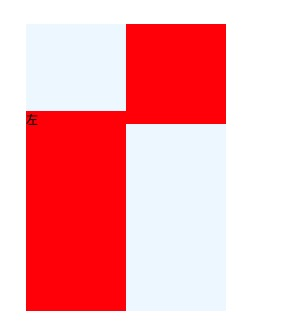

## incline-block
适用于定宽的块状元素

优点：没有 float 布局高度塌陷的问题，不需要清除浮动 <br />
缺点：需要处理间隙、错位问题

### 出现间隙的原因
inline-block 元素之间存在文本节点

``` html
<div class="container">
  <div class="box">左</div>
  <div class="box">右</div>
</div>
```

使用 [childNodes](https://developer.mozilla.org/zh-CN/docs/Web/API/Node/childNodes) 可获取包含文本节点的所有子节点；<br />
使用 [children](https://developer.mozilla.org/zh-CN/docs/Web/API/Element/children) 可获取不包含文本节点的所有子节点；

```js
document.querySelector('.container').childNodes
// NodeList[text, div, text, div, text]

document.querySelector('.container').children
// HTMLCollection[div, div]
```
children 和 childNodes 差别：https://www.cnblogs.com/snandy/archive/2011/03/11/1980085.html

### 清除间隙（清除文本节点）
父元素 font-size 设置成 0，此时子元素的 font-size 需要单独设置

``` css
.container {
  font-size: 0;
}
.box {
  font-size: 14px;
}
```

### 出现错位问题
``` html
<div class="container">
  <div class="box box1">左</div>
  <div class="box"></div>
</div>
```

``` css
.container {
  width: 200px;
  background-color: aliceblue;
  font-size: 0;
}
.box {
  display: inline-block;
  width: 100px;
  height: 100px;
  background-color: red;
  font-size: 12px;
}
.box1 {
  height: 200px;
}
```



因为 inline-block box 垂直对其方式 vertical-align 是 baseline （基线）导致的。第一个 box 的 baseline 是文字 "左" 的 baseline，第二个 box 这是下边框。

### 解决错位问题
统一 inline-block box 竖直对其方式 vertical-align 即可。

``` css
.box {
  ...
  vertical-align: top;
}
```


### refs
[inline-block 元素 vertical-align 的问题分析](https://www.cnblogs.com/zxjwlh/p/6219896.html) <br />
[MDN vertical-align](https://developer.mozilla.org/zh-CN/docs/Web/CSS/vertical-align)
