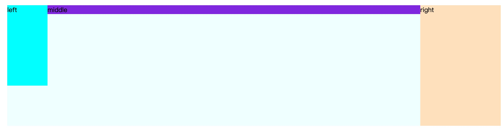

## 三栏布局（两端固宽，中间宽度自适应）



### 实现方法
- inline-block + calc
- float
- flex
- position 定位
- table 表格
- 圣杯布局
- 双飞翼布局

### inline-block + calc
- html 布局，left middle right；
- 全部设置成 [inline-block](./inline-block.md)；
- middle 通过 [calc](https://developer.mozilla.org/zh-CN/docs/Web/CSS/calc()) 使其宽度自适应；

``` html
<div class="wrap">
  <div id="left">left</div>
  <div id="middle">middle</div>
  <div id="right">right</div>
</div>
```

``` css
.wrap {
  min-width: 600px;
  background-color: azure;
  overflow: auto;
  font-size: 0;
}

.wrap > div {
  /* inline-block 间隙和错位问题 */
  display: inline-block;
  vertical-align: top;
  font-size: 14px;
}

#left {
  width: 100px;
  height: 200px;
  background-color: aqua;
}

#right {
  width: 200px;
  height: 300px;
  background-color: bisque;
}

#middle {
  /* middle 宽度自适应 */
  width: calc(100% - 300px);
  height: 100px;
  background-color: blueviolet;
}
```

### float
- html 布局，middle 在 left right 下边；
- left 左浮动，right 右浮动；
- middle 设置左右 margin，margin 值就是 left right 的宽度；
- 父元素设置 BFC，防止高度塌陷；

``` html
<div class="wrap">
  <div id="left">left</div>
  <div id="right">right</div>
  <div id="middle">middle</div>
</div>
```

``` css
.wrap {
  min-width: 600px;
  background-color: azure;
  overflow: auto;
}

#left {
  float: left;
  width: 100px;
  height: 200px;
  background-color: aqua;
}

#right {
  float: right;
  width: 200px;
  height: 300px;
  background-color: bisque;
}

#middle {
  margin: 0 200px 0 100px;
  height: 100px;
  background-color: blueviolet;
}
```

### flex
- 父元素设置成 flex；
- 第一种：
  - html 布局：left middle right；
- 第二种：
  - html 布局：middle left right（能保证 middle 能优先加载）；
  - left order 设置成 -1（成 flex 布局中的最左边）；
- left right 固宽后，middle 设置成 flex 1；

``` html
<div class="wrap">
  <div id="left">left</div>
  <div id="middle">middle</div>
  <div id="right">right</div>
</div>
```

``` css
.wrap {
  min-width: 600px;
  background-color: azure;
  /* 父元素固宽 */
  display: flex;
}

#left {
  flex: 0 0 100px;
  height: 200px;
  background-color: aqua;
}

#right {
  flex: 0 0 200px;
  height: 300px;
  background-color: bisque;
}

#middle {
  /* 中间自适应 */
  flex: 1;
  height: 100px;
  background-color: blueviolet;
}
```

### position 定位
- html 布局：left middle right
- 父元素相对定位，left 定位在左，right 定位在右；
- middle 设置左右 margin；

``` css
.wrap {
  min-width: 600px;
  background-color: azure;
  /* 父元素相对定位 */
  position: relative;
}

#left {
  /* left 定位在左 */
  position: absolute;
  left: 0;
  top: 0;
  width: 100px;
  height: 200px;
  background-color: aqua;
}

#right {
  /* right 定位在右 */
  position: absolute;
  right: 0;
  top: 0;
  width: 200px;
  height: 300px;
  background-color: bisque;
}

#middle {
  /* middle 设置左右 margin */
  margin: 0 200px 0 100px;
  height: 100px;
  background-color: blueviolet;
}
```

### table 表格
原理：类似 flex-shrink: 1，没固定宽度的 table-cell 会自动瓜分剩余空间；
- html 布局：left middle right;
- 父元素 display 设置成 table 布局;
- 子元素 display 设置成 table-cell；

``` css
.wrap {
  min-width: 600px;
  background-color: azure;
  display: table;
  width: 100%;
}

.wrap > div {
  display: table-cell;
}

#left {
  width: 100px;
  height: 200px;
  background-color: aqua;
}

#right {
  width: 200px;
  height: 300px;
  background-color: bisque;
}

#middle {
  height: 100px;
  background-color: blueviolet;
}
```

### 圣杯布局和双飞翼布局

[圣杯布局和双飞翼布局](./圣杯和双飞翼.md)

### 最佳实践
- flex 最简单易理解；
- inline-block + calc、float、table、position 兼容性最好；
- 圣杯和双飞翼相对以上方式比较麻烦；
