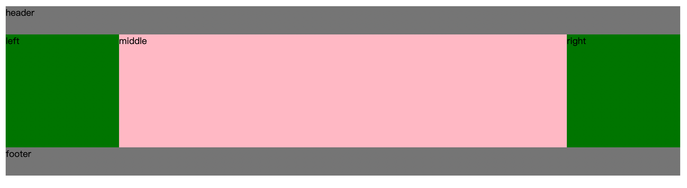

### 圣杯布局和双飞翼布局
实现三栏布局（两边固定宽度，中间自适应）的两种特殊方式。它们的原理：利用 margin 为负的特性：
- margin 百分数，是相对于父元素宽高计算的；
- 同时会更改文档流的排列；

### 圣杯布局步骤及解释
``` html
<div class="wrap">
  <div id="header">header</div>
  <div id="content">
    <div id="middle">middle</div>
    <div id="left">left</div>         
    <div id="right">right</div>
  </div>
  <div id="footer">footer</div>
</div>
```

``` css
.wrap{
  min-width: 600px;
}
#header, #footer {
  height: 50px;
  width: 100%;
  background: grey;
}
#content {
  margin: 0 200px;
  overflow: hidden;
}

#left, #middle, #right {
  float: left;
  height: 200px;
}
#middle {
  background: pink;
  width: 100%;
  overflow: auto;
}
#left, #right {
  width: 200px;
  background: green;
}
#left {
  margin-left: -100%;
  position: relative;
  left: -200px;
}
#right {
  margin-left: -200px;
  position: relative;
  right: -200px;
}
```

- 父元素左右设置 padding，来给 left、right 预留位置；
- html 排版时，将 middle 放到 left right 上部，提前渲染；
- left middle right 全部 “左浮动”；
- middle 宽度设置成 100%，因为父元素水平宽度全被 middle 占据，left right 只能排在下面；
- 可使用 margin 为负值的特性，将 left right “提到上边”，和 middle 同一水平方向上；
- left margin 设置成 -100%，其将位于父元素内容的最左边，此时配合绝对定位使其向左移动（left 为 -leftWidth）；
- right margin 设置成 -rightWidth，其将位于父元素内容的最右边，此时配合绝对定位使其向右移动（right 为 -rightWidth）；

  


### 双飞翼布局步骤及解释
``` html
<div class="wrap">
  <div id="header">header</div>
  <div id="content">
    <!-- 给 middle 增加子元素 -->
    <div id="middle">
      <div class="inner-middle">middle</div>
    </div>
    <div id="left">left</div>
    <div id="right">right</div>
  </div>
  <div id="footer">footer</div>
</div>
```

``` css
.wrap{
  min-width: 600px;
}
#header, #footer{
  height: 50px;
  width: 100%;
  background:grey;
}
#content {
  /* padding: 0 200px; */
  overflow: hidden;
}

#left, #middle, #right{
  float: left;
  height: 200px;
}
#left, #right {
  width: 200px;
  background: green;
}
#middle {
  background: pink;
  width: 100%;
  overflow: auto;
}
#left {
  margin-left: -100%;
  /* position: relative;
  left: -200px; */
}
#right {
  margin-left: -200px;
  /* position: relative;
  right: -200px; */
}

/* 设置 inner-middle 外间距 */
#middle .inner-middle {
  margin: 0 200px;
}
```

- 父元素左右不用通过 padding 预留位置；
- 将 middle 放到 left right 上部，提前渲染；
- left middle right 全部 “左浮动”；
- middle 宽度设置成 100%，因为父元素水平宽度全被 middle 占据，left right 只能排在下面；
- 可使用 margin 为负值的特性，将 left right “提到上边”，和 middle 同一水平方向上；
- left margin 设置成 -100%，其将位于父元素内容的最左边；
- right margin 设置成 -rightWidth，其将位于父元素内容的最右边；
- middle 的子元素 inner-middle，通过设置 <code>margin: 0 rightWidth 0 leftWidth</code>，限制其内容区域大小，使得内容不被 left、right 挡住；

  > <i>效果同上</i>

### 两种布局共同点
- 将 middle 放到 left、right 上部，提前渲染；
- left、middle、right 全部 “左浮动”；
- middle 宽度设置成 100%，因为父元素水平宽度全被 middle 占据，left、right 只能排在下面；
- 可使用 margin 为负值的特性，将 left、right “提到上边”，和 middle 同一水平方向上；
- left margin 设置成 -100%，其将位于父元素内容的最左边；
- right margin 设置成 -rightWidth，其将位于父元素内容的最右边；

### 两种布局不同点
圣杯布局：
 - 需要父元素设置左右 padding 给 left right 预留位置；
 - 需要对 left right 相对定位移动位置，防止遮盖中间部分；

双飞翼布局：
 - 不需要预留位置；
 - 不需要对 left right 进行定位；
 - 需要设置 inner-middle 的 margin；

### refs
- [深入理解圣杯布局和双飞翼布局](https://juejin.cn/post/6844903817104850952)
- [css布局之圣杯布局和双飞翼布局](https://juejin.cn/post/6844903568718184461)
