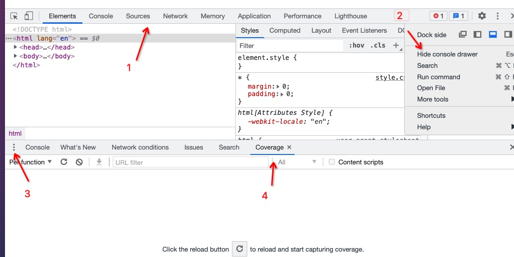
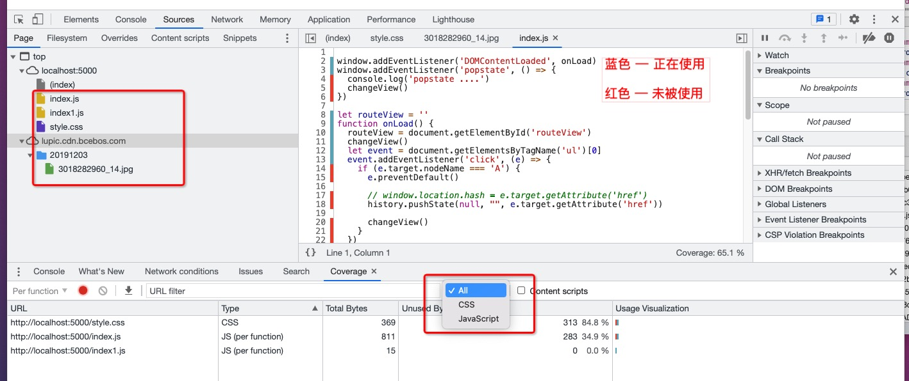

## Coverage
chrome 称之为 “覆盖率”，Edge 汉化成 “覆盖范围”。

Coverage 可看作一个**分析工具**：位于 `chrome devTools` 里的 Coverage 栏目，能帮助开发者寻找未被使用的资源（js 和 css），如果这些未被正在使用的资源被移除/懒加载，将会提升网站加载速度、节省用户流量。

### 打开 Coverage tab
- 打开网站控制台。
- 在右部菜单按钮内点击 `Show console drawer`（显示控制台抽屉）。
- 点击 “控制台抽屉” 左边的菜单按钮，选择 Coverage（Edge 汉化为覆盖范围）。

### 使用 Coverage
- 打开 coverage 后，点击刷新按钮，页面会重新加载。此时 coverage 面板上会分析出当前页面所加载的 js/css 资源。
- 点击 “红色按钮”，会停止记录代码覆盖率。

### 分析代码覆盖率
Coverage选项卡中的表格显示分析了哪些资源，以及每个资源中使用了多少代码。单击一行以在“源”面板中打开该资源，并查看已使用代码和未使用代码的逐行细分。

如上图，localhost:5000 这个站点的 index.html 文档，加载了 index.js、index1.js、xxx.jpg。
- 在 coverage tab 内只能过滤 js/css 的加载情况。
- 每个 js/css 资源条目，都会展示类型、全部字节数、未使用的字节数（及其占比）、未使用和使用可视化比例。

### refs
- [chrome 开发者工具-使用 Coverage 选项卡查找未使用的 JavaScript 和 CSS](https://developer.chrome.com/docs/devtools/coverage/)
- [Chrome DevTools 代码覆盖率功能详解](https://zhuanlan.zhihu.com/p/26281581)
